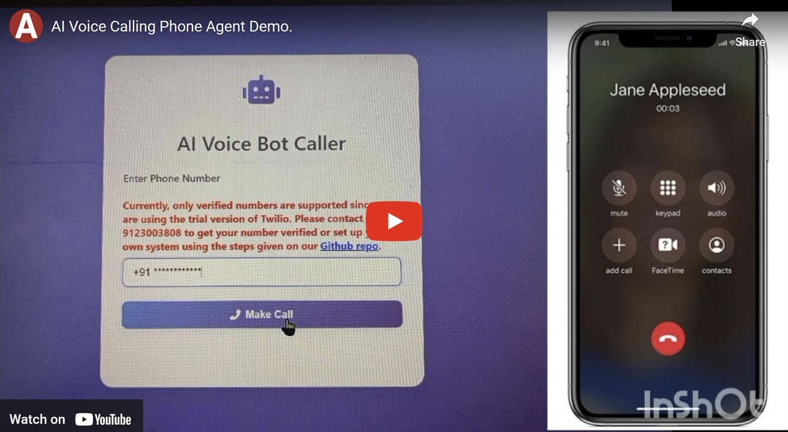

# AI Voice Calling Bot with Human-Like Conversations

<div align="center">
  
  [](https://www.python.org/downloads/)
  [](https://flask.palletsprojects.com/)
  [](https://www.twilio.com/)
  [](https://ai.google.dev/)
</div>

## Demo Video

[](https://youtu.be/eioGKkRR43g?si=-fahyHZuT2fT08M0)

---

## 📑 Table of Contents
- [Project Highlights](#project-highlights-)
- [Core Features](#core-features-)
- [Technical Excellence](#technical-excellence-)
- [Use Cases](#use-cases)
- [Complete Setup Guide for Voice Call AI Application](#complete-setup-guide-for-voice-call-ai-application)

---

## Project Highlights ✨

- **Remarkably Human-Like Interactions**: Engages in natural, fluid conversations that feel genuinely human, complete with context awareness and appropriate pauses
- **Emotional Intelligence**: Recognizes and responds to customer emotions, adapting tone and responses accordingly
- **Dynamic Information Access**: Instantly retrieves and communicates information from databases in a conversational manner
- **Real-Time Knowledge Sharing**: Provides accurate, up-to-date information while maintaining natural dialogue flow
- **Memory & Context**: Remembers conversation history and maintains context throughout the call, just like a human agent
- **Smart Response Adaptation**: Adjusts communication style based on customer preferences and needs

### Core Features 🚀

- **Contextual AI Brain**: Powered by Google's Gemini Pro for incredibly natural conversations
- **Sentiment Analysis**: Understands customer emotions and responds with appropriate empathy
- **Intelligent Query Resolution**: Provides customers with accurate and detailed answers to any kind of inquiries among billions of equiry possible from a vast knowledge base.
- **Interactive Voice Interface**: Crystal-clear voice synthesis with Deepgram for natural speech
- **Smart Database Integration**: Seamlessly accesses and communicates database information (customise database .csv file as per the need)
- **Real-Time Processing**: Lightning-fast speech recognition and response generation
- **User-Friendly Control**: Simple web interface to manage and initiate calls to customers.

### Technical Excellence 💫

- **Advanced AI Technology**: Google Generative AI (gemini-2.0-flash-exp) for human-like conversation
- **Professional Voice Services**: Twilio telephony integration
- **High-Quality Speech**: Deepgram text-to-speech for natural voice output
- **Robust Backend**: Python Flask server with comprehensive error handling
- **Efficient Audio Processing**: FFmpeg integration for optimal voice quality
- **Clean Frontend**: Intuitive HTML/JavaScript interface

### Use Cases

- 🎯 Customer Service Excellence
- 📅 Smart Appointment Management
- ℹ️ Dynamic Information Services
- 📞 Intelligent Support Lines
- 📊 Interactive Surveys
- 🤝 Automated Follow-ups

## NOTE: BASIC WORKING ARCHITECTURE OF PHONE AGENT IS SIMILAR AS STANDALONE VERSION OF THIS VOICE CALLING !


## Complete Setup Guide for Voice Call AI Application

### 1. Python Environment Setup

#### Python Version Requirements
- Python 3.8 or higher
- Recommended: Python 3.10


#### Follow these steps to clone the repository and create a virtual environment .

---

##### **1. Clone the Repository**

1. Open **Command Prompt** or **Terminal**.
2. Navigate to the folder where you want to clone the repository:
   ```bash
   cd path/to/your/folder
   ```
3. Clone the repository using Git:
   ```bash
   git clone https://github.com/arunangshu/ai-calling-agent.git
   ```

4. Navigate into the cloned project folder:
   ```bash
   cd ai-calling-agent
   cd phone_agent
   ```

---

##### **2. Create a Virtual Environment**

1. Create a virtual environment (`venv`) in the project folder:
   ```bash
   python -m venv venv
   ```

2. **Activate the Virtual Environment**:
   - On **Windows**:
     ```bash
     .\venv\Scripts\activate
     ```
   - On **macOS/Linux**:
     ```bash
     source venv/bin/activate
     ```

   You should see `(venv)` at the beginning of your terminal prompt, indicating the virtual environment is active.

---


#### Conclusion

You have successfully set up the project with a virtual environment. You can now start working on the project.


### 2. Package Installation
```bash
pip install --upgrade pip
pip install -r requirements.txt
```


#### Common Package Installation Issues
1. **pydub Installation Issues**
   - Error: `FileNotFoundError: [Errno 2] No such file or directory: 'ffmpeg'`
   ```
   Solution: Install FFmpeg (see FFmpeg section below)
   ```
   
2. **Package Installation Errors**
   ```bash
   # Windows: Install Build Tools if needed
   # Download from: https://visualstudio.microsoft.com/visual-cpp-build-tools/
   
   # Linux (Ubuntu/Debian)
   sudo apt-get install python3-dev build-essential
   ```

####  FFmpeg Installation (Required for pydub)

##### Windows
1. Download FFmpeg from https://ffmpeg.org/download.html
2. Extract to C:\ffmpeg
3. Add to System PATH:
   - Open System Properties → Advanced → Environment Variables
   - Edit Path variable
   - Add new entry: C:\ffmpeg\bin

##### MacOS
```bash
brew install ffmpeg
```

##### Linux
```bash
# Ubuntu/Debian
sudo apt-get update
sudo apt-get install ffmpeg

# CentOS/RHEL
sudo yum install epel-release
sudo yum install ffmpeg ffmpeg-devel
```
##### If previous way does not work this is the alternative way to do ffmpeg installation :- 

Follow these steps to download and set up FFmpeg on your Windows system using an alternative GitHub release.

---

###### **1. Download FFmpeg from GitHub**

1. Go to the FFmpeg Builds GitHub page:  
   [FFmpeg Builds GitHub](https://github.com/BtbN/FFmpeg-Builds/releases)
2. Download the `ffmpeg-master-latest-win64-gpl.zip` file under the "Latest" release.
3. Extract the ZIP file to a folder (e.g., `C:\ffmpeg`).

---

###### **2. Set Up Environment Variables**

1. **Locate Executables**: Inside the extracted folder, ensure `ffmpeg.exe`, `ffplay.exe`, and `ffprobe.exe` are in the `bin` folder.
   - If `bin` folder is missing, create it and move the executables there.

2. **Add to System Path**:
   - Right-click **This PC** → **Properties** → **Advanced system settings** → **Environment Variables**.
   - Under **System variables**, find `Path` → **Edit** → **New** and add `C:\ffmpeg\bin`.
   - Click **OK** to save changes.

---

##### Verify FFmpeg Installation
```bash
ffmpeg -version
```

### 3. External Services Setup

#### A. Ngrok Setup
1. Download Ngrok from https://ngrok.com/download
2. Create free account at https://ngrok.com
3. Get your auth token from dashboard
4. Setup Ngrok:
   ```bash
   # Windows
   ngrok config add-authtoken YOUR_AUTH_TOKEN
   
   # Linux/MacOS
   ./ngrok config add-authtoken YOUR_AUTH_TOKEN
   ```
5. Start Ngrok:
   ```bash
   ngrok http 5000
   ```

#### B. Twilio Setup
1. Create account at https://www.twilio.com/try-twilio
2. Get from Twilio Console:
   - Account SID
   - Auth Token
   - Purchase a Phone Number with voice capabilities
3. Configure webhook URL: (after running ngrok in terminal : url will be given by ngrok)
   - Go to Phone Numbers → Active Numbers
   - Select your number
   - Under Voice & Fax:
     - Set webhook URL to your Ngrok URL + "/start_conversation"
     - Method: HTTP POST

#### C. Deepgram Setup
1. Create account at https://deepgram.com/
2. Generate API key with TTS permissions
3. Store key in .env file

#### D. Google AI (Gemini) Setup
1. Visit https://ai.google.dev/
2. Create new project
3. Enable Gemini API
4. Generate API key
5. Add to .env file

### 4. Application Configuration

#### Environment Variables
Create .env file in project root:
```
TWILIO_ACCOUNT_SID=your_account_sid
TWILIO_AUTH_TOKEN=your_auth_token
TWILIO_PHONE_NUMBER=your_twilio_phone_number
GOOGLE_API_KEY=your_gemini_api_key
WEBHOOK_BASE_URL=your_ngrok_url
```

#### Database Setup
1. Update details in Products.csv if required with columns:
   ```
   Product Name,Category,Brand,Price in Rupees,Stock,Description
   ```
2. If you need to change the entire structure of Products.csv, update the initial prompt accordingly.

### 5. Running the Application

#### Starting the Application 
1. Start Ngrok first (in terminal opened in the project folder):
   ```bash
   ngrok http 5000
   ```

2. Copy Ngrok HTTPS URL and update:
   - .env file WEBHOOK_BASE_URL
   - Twilio webhook URL (process given above)

3. Start Flask application (in another terminal opened in the project folder `phone_agent`):
   ```bash
   python phone_agent_app.py
   ```

### 6. Troubleshooting Guide

#### FFmpeg Issues
1. **Command Not Found**
   ```
   Solution: Verify PATH environment variable includes FFmpeg
   ```

2. **Audio Processing Error**
   ```
   Solutions:
   1. Check FFmpeg installation
   2. Verify file permissions
   3. Check audio file format support
   ```

#### Ngrok Issues
1. **Connection Failed**
   ```
   Solutions:
   1. Check internet connection
   2. Verify auth token
   3. Ensure port 5000 is available
   ```

2. **Address Already in Use**
   ```bash
   # Windows
   netstat -ano | findstr :5000
   taskkill /PID <PID> /F

   # Linux/MacOS
   lsof -i :5000
   kill -9 <PID>
   ```

#### Twilio Issues
1. **Call Failed**
   ```
   Check:
   1. Account balance
   2. Phone number format
   3. Webhook URL accessibility
   4. Ngrok tunnel status
   ```

2. **Webhook Errors**
   ```
   Solutions:
   1. Verify Ngrok is running
   2. Check webhook URL in Twilio console
   3. Ensure Flask app is running
   ```

#### Deepgram Issues
1. **TTS Failed**
   ```
   Check:
   1. API key validity
   2. API quota
   3. Text length (max 5000 chars)
   ```

#### Database Issues
1. **CSV Loading Error**
   ```
   Solutions:
   1. Verify CSV format
   2. Check file encoding (use UTF-8)
   3. Ensure all required columns present
   ```

2. **SQLite Errors**
   ```
   Solutions:
   1. Check file permissions
   2. Verify CSV data types
   3. Ensure sufficient disk space
   ```

### 7. Testing Your Setup

#### Test Environment Variables
```python
import os
from dotenv import load_dotenv

load_dotenv()
required_vars = [
    'TWILIO_ACCOUNT_SID',
    'TWILIO_AUTH_TOKEN',
    'TWILIO_PHONE_NUMBER',
    'GOOGLE_API_KEY',
    'WEBHOOK_BASE_URL'
]

for var in required_vars:
    if not os.getenv(var):
        print(f"Missing: {var}")
```

#### Test Twilio Connection
```python
from twilio.rest import Client

account_sid = os.getenv('TWILIO_ACCOUNT_SID')
auth_token = os.getenv('TWILIO_AUTH_TOKEN')

try:
    client = Client(account_sid, auth_token)
    client.api.accounts(account_sid).fetch()
    print("Twilio connection successful")
except Exception as e:
    print(f"Twilio error: {e}")
```

#### Test Database
```python
import pandas as pd
import sqlite3

try:
    df = pd.read_csv('Products.csv')
    conn = sqlite3.connect(':memory:')
    df.to_sql('inventory', conn, if_exists='replace', index=False)
    print("Database setup successful")
except Exception as e:
    print(f"Database error: {e}")
```

### 8. Production Considerations

1. Always keep Ngrok running to maintain webhook accessibility
2. Monitor Twilio credit balance
3. Track API usage for Deepgram and Gemini
4. Regular backup of Products.csv
5. Monitor Flask application logs
6. Consider rate limiting for API endpoints
7. Implement proper error handling
8. Regular testing of voice quality
9. Monitor memory usage

### 9. Security Considerations

1. Never commit .env file to version control
2. Keep API keys secure
3. Regularly rotate API keys
4. Use HTTPS for all external communications
5. Implement input validation
6. Monitor for suspicious activities
7. Keep all packages updated
8. Regular security audits

### 10. Maintenance Tips

1. Regularly check API quotas
2. Monitor disk space usage
3. Keep logs rotated
4. Regular backups
5. Update dependencies periodically
6. Test after each update
7. Monitor application performance
8. Keep documentation updated
